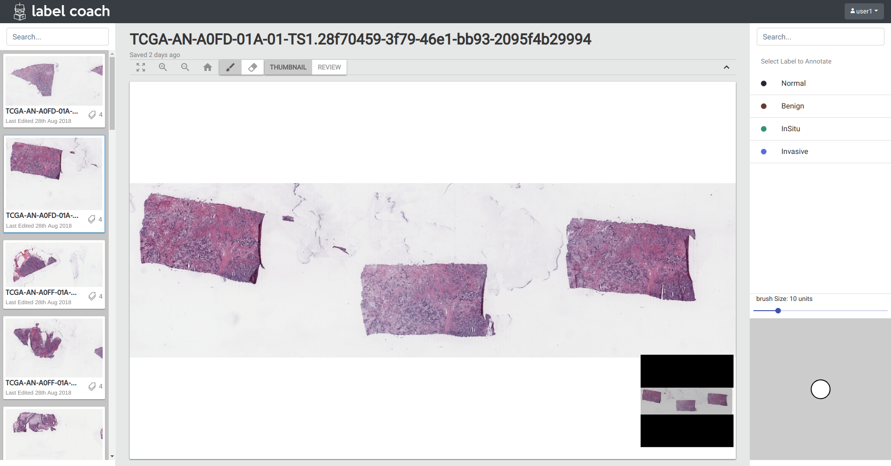

# Label Coach

[](https://travis-ci.org/chaitanya2334/label-coach)

[](https://github.com/chaitanya2334/label-coach/actions)


## Installation Instructions

Requirements
1. Node 8.11.4+
2. mongodb
3. npm 5.6+
4. python 3.6
5. Cairo 1.15 (for canvas)

### Step 1: Install girder

Pull girder submodule
```bash
cd label-coach
git submodule update --init --recursive
```
Install all girder python dependencies
```bash
cd label-coach/girder
pip install -r requirements-dev.txt
```

### Step 2: Install `label_coach` plugin

#### Install all python dependencies. 

##### Linux Distributions
For conda environments use environment.yml in the root directory `label-coach` 
```bash
conda env create -n label-coach -f environment.yml
# then activate the conda virtual environment
source activate label-coach
```
Make sure you have installed openslide-python. Follow installation instructions for openslide and openslide-python installation here : https://openslide.org/download/


##### OSX
For conda environments use environment.yml in the root directory `label-coach` 
```bash
conda env create -n label-coach -f environment.osx.yml
# then activate the conda virtual environment
source activate label-coach
```

We make use of openslide to support .svs images. To install openslide on OSX you will have to make use of Homebrew

```bash
brew install openslide
```


Install all the npm dependencies inside `label_coach` dir
```bash
cd label-coach/label_coach
npm install
```

Install plugin into girder. Make sure to provide absolute path to `label_coach` dir.
```bash
girder-install plugin -s /absolute/path/to/label_coach
```

### Step 3: Start up girder and activate plugin.  Start mongodb if you havent already.

Install girder web client
```bash
sudo service mongod start
girder-install web
```

Start girder server. Below command will start the server on localhost:8080. check girder documentation 
for more options
```bash
girder serve
```

Register admin account 

[Image here]

Enable plugin and restart

[Image here]

Change `core_girder` route from `/` to `/girder`. This setting is found in your `Admin console > Server configuration`.

Restart the server. You are now all set!

## Development Instructions

Step 1: Follow the installation instructions above 

Step 2: start webpack watch and server on two seperate terminals
```bash
girder-install web --watch-plugin label_coach 
```

```bash
girder serve
```

